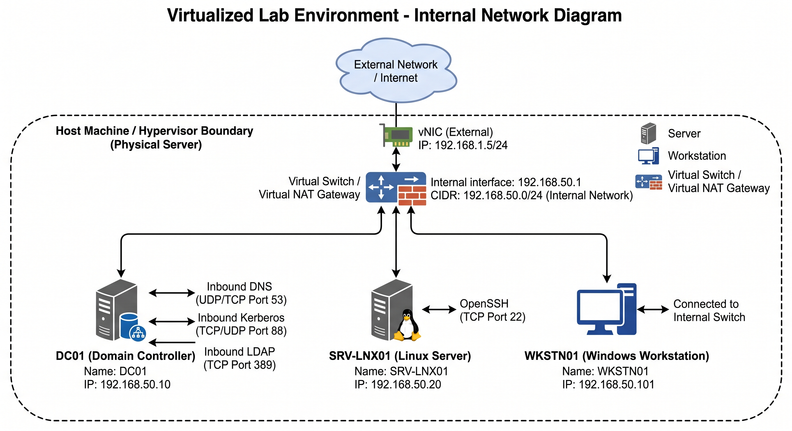

# Phase 1: Network Topology & Virtual Switch Configuration

## Overview
This document details the virtual network architecture, subnet design, and traffic isolation established for the `it-support-operations-lab` environment. The environment uses an isolated virtual switch to simulate an enterprise branch office without exposing production home devices to lab traffic.

---

## Network Architecture Diagram



---

## Subnetting & Address Allocation

* **Management & Traffic Subnet:** `192.168.50.0/24`
* **Subnet Mask:** `255.255.255.0`
* **Broadcast:** `192.168.50.255`
* **Gateway:** `192.168.50.1`

| Hostname | Role | Operating System | IP Address | MAC Address (Virtual) | Notes |
| :--- | :--- | :--- | :--- | :--- | :--- |
| **Hypervisor GW** | Virtual Switch / Router | N/A | `192.168.50.1` | - | Handles NAT outbound to WAN |
| **DC01** | Domain Controller / DNS | Windows Server 2022 | `192.168.50.10` | Static | Authoritative for `corp.homelab.local` |
| **SRV-LNX01** | App / Utility Server | Ubuntu Server 22.04 | `192.168.50.20` | Static | Netplan static assignment |
| **WKSTN01** | Enterprise Workstation | Windows 10/11 Ent | `192.168.50.101` | Static / DHCP | Domain-joined client |

---

## Virtual Switch Configuration

### Hypervisor Configuration
- **Network Mode:** Isolated NAT Network (`LabNet`)
- **Isolation Policy:** Inter-VM traffic permitted; VM-to-Host Physical Subnet (`192.168.1.0/24`) blocked.
- **Port Groups / Virtual Adapters:** Single flat virtual switch simulating access layer access.

---

## Verification & Connectivity Evidence

### Routing Table Verification (Linux Host)
```text
$ ip route show
default via 192.168.50.1 dev ens33 proto static metric 100
192.168.50.0/24 dev ens33 proto kernel scope link src 192.168.50.20 metric 100
